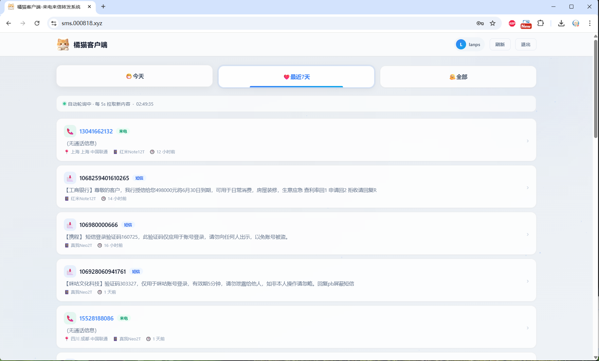
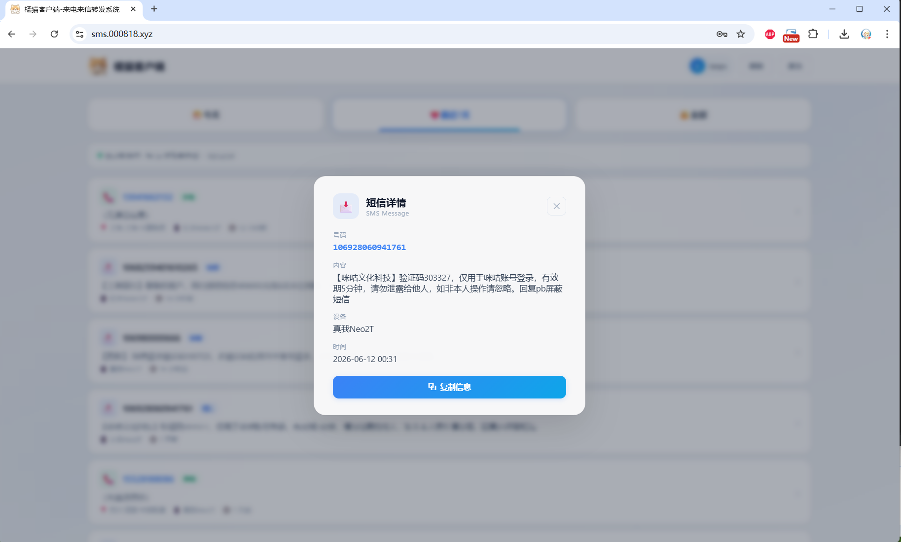
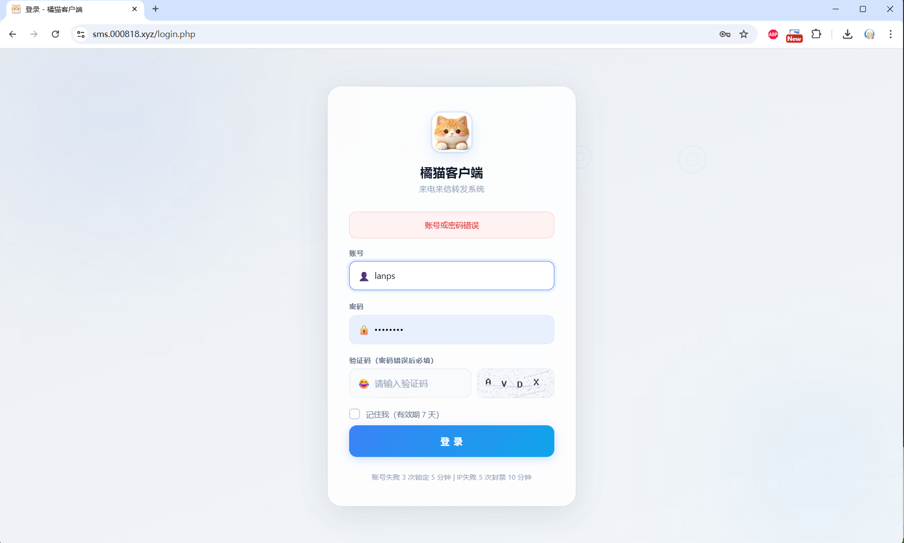
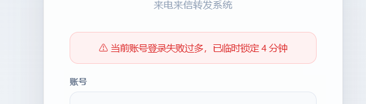
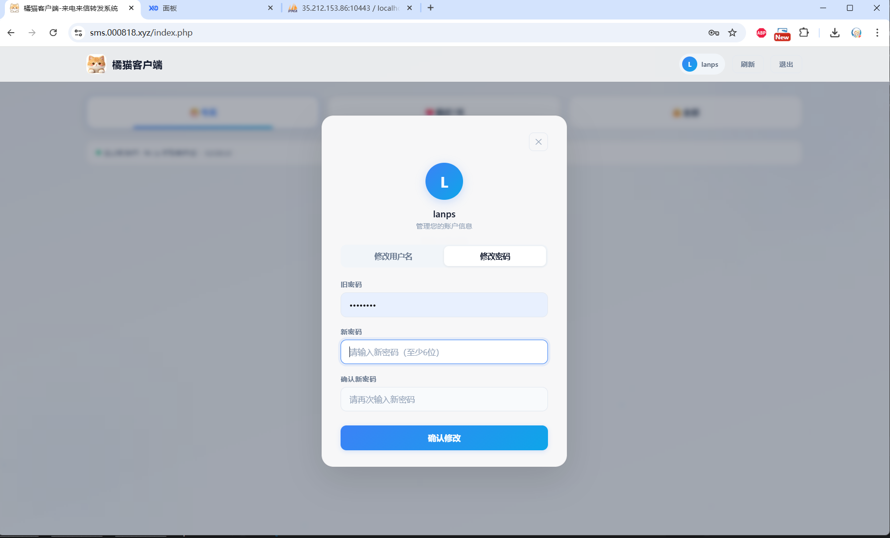
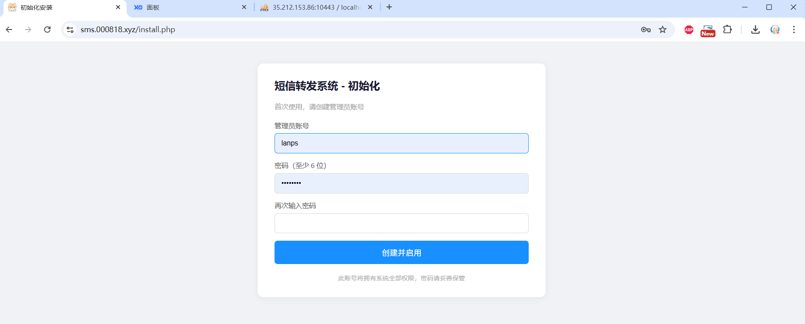

# 橘猫网页端 - PHP 短信/来电转发管理系统

<div align="center">

[](LICENSE)
[](https://php.net)
[](https://mysql.com)
[](http://makeapullrequest.com)

**轻量级 · 零依赖 · 开箱即用**

[快速开始](#快速开始) · [API文档](#api-接口文档) · [配置说明](#自定义配置) · [常见问题](#常见问题)

</div>

---

## 📖 项目简介

基于 **PHP 8.1 + MySQL** 的**短信转发管理系统**和**来电转发管理系统**，专为多设备短信管理和远程监控设计。这是一个完整的**短信转发后台**解决方案，支持接收来自 Android 设备的**短信转发**、**来电转发**、**验证码转发**数据，提供美观的 Web 管理界面和 RESTful API。
>
>这是三合一的项目 分为前-中-后 三部分


### 🌐 在线演示
> **演示站点**: https://sms.000818.xyz/

演示账号：`lanps`
演示密码：`11qqaazz`

> ⚠️ **注意**：演示站数据每日自动清空，请勿存储重要信息
>

>
### 🎯 适用场景

- **多设备短信管理**：集中管理多台 Android 设备的短信，统一查看和搜索
- **远程短信监控**：通过 Web 界面远程查看手机收到的短信和来电记录
- **验证码自动转发**：配合 Android 转发端，自动将短信验证码转发到服务器，方便在电脑上查看
- **来电记录管理**：记录所有来电信息，包括来电号码、归属地、通话时间
- **短信备份与归档**：自动备份重要短信，防止丢失
- **团队协作**：多人共享查看短信和来电记录，适合团队使用
- **物联网设备管理**：监控 IoT 设备发送的短信告警信息
- **营销短信管理**：管理和查看营销短信发送记录

### 🔑 核心关键词

短信转发、来电转发、验证码转发、短信管理系统、来电管理系统、短信转发后台、Android 短信转发、远程短信查看、短信备份、短信归档、多设备短信管理、短信验证码转发、Web 短信管理、PHP 短信系统、MySQL 短信管理、短信 API、来电 API、短信记录管理、短信监控、短信告警

### 💡 工作原理

1. **Android 转发端**（橘猫服务端）监听手机短信和来电
2. 收到短信/来电后，通过 **HTTPS API** 自动转发到本系统
3. 本系统接收数据并存储到 **MySQL 数据库**
4. 用户通过 **Web 管理界面**或**客户端 APP**实时查看

### 🌟 核心优势

- **零依赖**：前端原生 HTML/CSS/JS，无需 Node.js、npm 或任何前端框架，部署简单
- **开箱即用**：自动建表、安装向导、一键部署，5 分钟完成搭建
- **安全可靠**：多重安全防护（CSRF、XSS、SQL 注入、暴力破解、IP 封禁）
- **实时增量**：新数据自动推送到前端，无需手动刷新，支持 WebSocket 级别的实时体验
- **轻量高效**：Gzip 压缩、ETag 缓存、数据库索引优化，低配置服务器也能流畅运行
- **移动端适配**：响应式设计，手机、平板、电脑都能完美访问
- **多设备支持**：支持同时管理多台设备的短信和来电记录
- **API 友好**：提供完整的 RESTful API，方便二次开发和集成

### 📱 姊妹项目

| 项目 | 说明 | 链接 |
|------|------|------|
| **橘猫服务端** | Android 短信/来电转发端，负责监听和转发 | [GitHub](https://github.com/LanPS/OrangeCatsms) |
| **橘猫客户端** | Android 数据查看端，移动端查看短信和来电 | [GitHub](https://github.com/LanPS/OrangeCatweb) |

---

## ✨ 功能特性

### Web 管理后台

#### 数据看板
- **记录列表**：分页展示所有短信/来电记录
- **时间筛选**：今天、最近7天、全部
- **智能分页**：支持页码跳转、每页条数设置

>
> *数据看板界面截图*

#### 实时增量更新
- 新记录自动插入列表顶部
- 平滑动画效果（新记录从上方滑入）
- 无需手动刷新页面
- 基于 `since_id` 的高效增量拉取

#### 记录详情
- 点击查看完整短信内容
- 来电号码、归属地、通话时间
- 设备信息、事件时间

>
> 
> *记录详情弹窗截图*


#### 用户系统
- 登录/登出
- 密码加密（bcrypt 哈希）
- 记住我（7天免登录）
- 修改用户名/密码

> 
>
> *登录页面截图*

#### 安全防护
- **验证码**：登录失败后自动出现
- **账号锁定**：失败3次锁定5分钟
- **IP封禁**：失败5次封禁10分钟
- **CSRF防护**：每次请求验证 Token

>
> *封禁截图*

#### 修改用户名/密码
- 登录后进入个人中心，点击"修改资料"即可
- 也可通过 `/api/profile.php` 接口修改（需携带 Token）
- 修改成功后需重新登录

>
> *修改资料页面截图*

### RESTful API

| 接口 | 方法 | 说明 |
|------|------|------|
| `/api/receive.php` | POST | 接收服务端上报数据 |
| `/api/list.php` | GET | 分页/增量查询，支持 ETag 缓存 |
| `/api/detail.php` | GET | 单条记录查询 |
| `/api/profile.php` | POST | 修改用户名/密码 |
| `/api/test.php` | GET | 连接测试 |

---

## 🏗️ 系统架构

### 整体架构

```
┌─────────────────────────────────────────────────────────────┐
│                     橘猫网页端 (PHP + MySQL)                   │
│                                                               │
│  ┌──────────┐  ┌──────────┐  ┌──────────┐  ┌──────────┐   │
│  │index.php  │  │login.php  │  │install.php│  │logout.php │   │
│  │ 管理主页  │  │ 登录页面  │  │ 初始化安装 │  │ 退出登录  │   │
│  └─────┬─────┘  └──────────┘  └──────────┘  └──────────┘   │
│        │                                                      │
│  ┌─────▼────────────────────────────────────────┐            │
│  │              config.php (核心配置)              │            │
│  │  · 安全防护（HTTPS、CORS、安全响应头）          │            │
│  │  · 全局常量（密码策略、加密密钥、数据库配置）    │            │
│  │  · 会话管理（Session、记住我、Cookie）          │            │
│  │  · 数据库连接（PDO 封装）                       │            │
│  │  · 认证鉴权（Token、Session）                   │            │
│  │  · 用户系统（建表、创建用户、登录管理）          │            │
│  │  · 登录安全（IP/用户名锁定、失败计数、验证码）   │            │
│  │  · CSRF 防护                                    │            │
│  │  · 密码加密（AES-256-CBC）                      │            │
│  └─────┬────────────────────────────────────────┘            │
│        │                                                      │
│  ┌─────▼────────────────────────────────────────┐            │
│  │                  API 层                        │            │
│  │  ┌──────────┐  ┌──────────┐  ┌──────────┐   │            │
│  │  │receive.php│  │ list.php │  │detail.php│   │            │
│  │  │ 数据接收  │  │ 记录列表  │  │记录详情  │   │            │
│  │  └──────────┘  └──────────┘  └──────────┘   │            │
│  │  ┌──────────┐  ┌──────────┐                 │            │
│  │  │profile.php│  │ test.php │                 │            │
│  │  │ 个人资料  │  │ 连接测试  │                 │            │
│  │  └──────────┘  └──────────┘                 │            │
│  └─────┬────────────────────────────────────────┘            │
│        │                                                      │
│  ┌─────▼────────────────────────────────────────┐            │
│  │              MySQL 数据库                      │            │
│  │  ┌────────────────┐  ┌────────────────┐      │            │
│  │  │forward_records │  │     users      │      │            │
│  │  │  转发记录表    │  │    用户表      │      │            │
│  │  └────────────────┘  └────────────────┘      │            │
│  │  ┌────────────────┐  ┌────────────────┐      │            │
│  │  │remember_tokens │  │login_failures  │      │            │
│  │  │  记住我令牌    │  │  登录失败记录  │      │            │
│  │  └────────────────┘  └────────────────┘      │            │
│  │  ┌────────────────┐                          │            │
│  │  │ login_locks    │                          │            │
│  │  │  登录锁定表    │                          │            │
│  │  └────────────────┘                          │            │
│  └──────────────────────────────────────────────┘            │
└──────────────────────────────────────────────────────────────┘
         ▲                                    ▲
         │ HTTPS + Token                      │ HTTPS + Session
         │                                    │
   ┌─────┴──────┐                    ┌───────┴────────┐
   │ 橘猫服务端  │                    │  浏览器/客户端  │
   │ (数据上报)  │                    │  (数据查看)    │
   └────────────┘                    └────────────────┘
```

### 数据流转流程

```
1. 数据上报流程
   Android设备 → 橘猫服务端 → HTTPS POST → receive.php → MySQL

2. 数据查看流程（常规分页）
   浏览器 → HTTPS GET → list.php → MySQL → JSON响应 → 前端渲染

3. 数据查看流程（增量拉取）
   浏览器 → GET /api/list.php?since_id=100 → list.php
   → 查询 id > 100 的记录 → 返回增量数据 → 前端插入列表顶部

4. 登录流程
   浏览器 → 获取登录页 → 输入账号密码
   → 前端 AES 加密密码 → POST login.php
   → 验证 CSRF + 验证码 + 密码 → 创建 Session → 跳转主页
```

---

## 🔐 安全机制详解

### 1. 密码安全

#### 前端加密传输
```
用户输入密码 → Web Crypto API (AES-256-CBC) 加密
→ Base64 编码 → HTTPS 传输 → 服务端解密
```

**加密流程：**
1. 前端使用 `crypto.subtle.encrypt()` 加密密码
2. 密钥：`ENCRYPTION_KEY`（32字节，不足用0填充）
3. IV：16字节随机数
4. 输出格式：`Base64(IV + 密文)`
5. 服务端使用 `openssl_decrypt()` 解密

#### 后端哈希存储
```
明文密码 → bcrypt 哈希 → 数据库存储
```

**特点：**
- 使用 `password_hash()` 生成 bcrypt 哈希
- 自动加盐，防止彩虹表攻击
- 验证时使用 `password_verify()`

### 2. 暴力破解防护

#### 双重锁定机制

```
登录失败
  ├─ 记录到 login_failures 表（IP + 用户名）
  ├─ 检查用户名维度：失败 >= 3次 → 锁定5分钟
  └─ 检查 IP 维度：失败 >= 5次 → 封禁10分钟
```

**防护策略：**
- **账号锁定**：同一用户名失败3次，锁定5分钟
- **IP封禁**：同一IP失败5次，封禁10分钟
- **验证码**：登录失败后必须输入验证码
- **自动清理**：登录成功后清除所有失败记录

**安全特性：**
- 用户不存在时只记录 IP 维度（防止攻击者预锁定不存在的账号）
- 账号被禁用时不记录失败，直接拒绝
- 使用 `hash_equals()` 防止时序攻击

### 3. CSRF 防护

```
生成 Token → 存入 Session → 表单隐藏字段
→ 提交时验证 → 使用 hash_equals() 比较
→ 登录成功后轮换 Token（防止重放攻击）
```

### 4. 会话安全

#### Session 配置
```php
session_set_cookie_params([
    'lifetime' => 0,           // 浏览器关闭即失效
    'path'     => '/',
    'secure'   => isHttps(),   // HTTPS 下仅通过 HTTPS 发送
    'httponly' => true,        // 禁止 JavaScript 访问
    'samesite' => 'Lax',       // 防止 CSRF
]);
```

#### 记住我功能
```
生成 selector + token → token 哈希存入数据库
→ Cookie: selector|token → 自动登录时验证
→ 验证通过后轮换 token（防止重放）
```

**安全特性：**
- selector 明文存储（用于快速查询）
- token 使用 bcrypt 哈希存储（防止数据库泄露后伪造）
- 7天有效期，到期自动清理
- 登录时清除旧的 remember_tokens（强制所有设备重新登录）

### 5. 安全响应头

```http
X-Frame-Options: DENY                          # 防止点击劫持
X-Content-Type-Options: nosniff                # 防止 MIME 嗅探
Referrer-Policy: strict-origin-when-cross-origin
X-XSS-Protection: 1; mode=block                # XSS 过滤
Strict-Transport-Security: max-age=31536000    # HSTS（1年）
Content-Security-Policy: default-src 'self'    # CSP
```

### 6. CORS 同源策略

```php
// 仅允许同源请求
if ($origin === $scheme . '://' . $host) {
    header('Access-Control-Allow-Origin: ' . $origin);
}
```

---

## 🚀 快速开始

### 环境要求

| 组件 | 版本要求 | 说明 |
|------|----------|------|
| PHP | 8.1+ | 需开启 PDO、OpenSSL、GD、mbstring 扩展 |
| MySQL | 5.7+ | 或 MariaDB 10.3+ |
| Web服务器 | Nginx / Apache | 推荐 Nginx |
| HTTPS | 必须 | 生产环境强制 HTTPS |

**检查 PHP 扩展：**
```bash
php -m | grep -E "pdo_mysql|openssl|gd|mbstring"
```

### 部署步骤

#### 1. 下载源码

```bash
# 克隆仓库
git clone https://github.com/lan-ps/OranageCatweb.git
cd orange-cat-web

# 或下载 ZIP
wget https://github.com/lan-ps/OranageCatweb/archive/main.zip
unzip main.zip
cd orange-cat-web-main
```

#### 2. 配置数据库

编辑 `config.php`，修改数据库配置：

```php
// ====== 数据库配置 ======
define('DB_HOST', 'localhost');       // 数据库主机
define('DB_NAME', 'sms_forward');     // 数据库名
define('DB_USER', 'your_db_user');    // 数据库用户名
define('DB_PASS', 'your_db_password');// 数据库密码
```

#### 3. 修改安全配置

**⚠️ 必须修改以下三项（不要使用默认值）：**

```php
// ====== 认证与会话 ======
define('AUTH_TOKEN', 'CHANGE_ME_TO_RANDOM_TOKEN');  // API 认证 Token

// ====== 加密 ======
define('ENCRYPTION_KEY', 'CHANGE_ME_TO_RANDOM_32BYTES_KEY');  // AES 加密密钥
```

**生成随机 Token：**
```bash
# 方法1：PHP 生成
php -r "echo bin2hex(random_bytes(16)).PHP_EOL;"

# 方法2：OpenSSL 生成
openssl rand -hex 16

# 方法3：在线工具
# https://www.random.org/strings/
```

**生成 32 字节加密密钥：**
```bash
# 生成 32 字符的随机字符串
php -r "echo bin2hex(random_bytes(16)).PHP_EOL;"
```

#### 4. 创建数据库

```sql
-- 登录 MySQL
mysql -u root -p

-- 创建数据库
CREATE DATABASE sms_forward DEFAULT CHARACTER SET utf8mb4 COLLATE utf8mb4_unicode_ci;

-- 创建用户并授权（推荐）
CREATE USER 'sms_user'@'localhost' IDENTIFIED BY 'your_password';
GRANT SELECT, INSERT, UPDATE, DELETE, CREATE ON sms_forward.* TO 'sms_user'@'localhost';
FLUSH PRIVILEGES;

-- 退出
exit;
```

> **提示**：数据库表会在首次访问 `install.php` 时自动创建。

#### 5. 配置 Web 服务器

##### Nginx 配置（推荐）

```nginx
server {
    listen 443 ssl http2;
    server_name your-domain.com;
    root /path/to/orange-cat-web;
    index index.php;

    # SSL 证书配置
    ssl_certificate     /etc/letsencrypt/live/your-domain.com/fullchain.pem;
    ssl_certificate_key /etc/letsencrypt/live/your-domain.com/privkey.pem;
    
    # SSL 优化
    ssl_protocols TLSv1.2 TLSv1.3;
    ssl_ciphers HIGH:!aNULL:!MD5;
    ssl_prefer_server_ciphers on;

    # 日志
    access_log /var/log/nginx/sms_forward_access.log;
    error_log /var/log/nginx/sms_forward_error.log;

    # 主目录
    location / {
        try_files $uri $uri/ /index.php?$query_string;
    }

    # PHP 处理
    location ~ \.php$ {
        fastcgi_pass unix:/var/run/php/php8.1-fpm.sock;
        fastcgi_param SCRIPT_FILENAME $document_root$fastcgi_script_name;
        include fastcgi_params;
        
        # PHP 优化
        fastcgi_buffer_size 128k;
        fastcgi_buffers 256 4k;
    }

    # 禁止访问敏感文件
    location ~ /\. {
        deny all;
    }
    
    location ~ /(config\.php|php_errors\.log|\.env)$ {
        deny all;
    }

    # 静态资源缓存
    location ~* \.(jpg|jpeg|png|gif|ico|css|js|svg|woff|woff2|ttf|eot)$ {
        expires 30d;
        add_header Cache-Control "public, immutable";
    }
}

# HTTP 重定向到 HTTPS
server {
    listen 80;
    server_name your-domain.com;
    return 301 https://$server_name$request_uri;
}
```

##### Apache 配置

```apache
<VirtualHost *:443>
    ServerName your-domain.com
    DocumentRoot /path/to/orange-cat-web

    # SSL 配置
    SSLEngine on
    SSLCertificateFile /etc/letsencrypt/live/your-domain.com/fullchain.pem
    SSLCertificateKeyFile /etc/letsencrypt/live/your-domain.com/privkey.pem

    # 目录配置
    <Directory /path/to/orange-cat-web>
        AllowOverride All
        Require all granted
    </Directory>

    # 禁止访问敏感文件
    <FilesMatch "^(config\.php|php_errors\.log|\.env)$">
        Require all denied
    </FilesMatch>

    # 日志
    ErrorLog ${APACHE_LOG_DIR}/sms_forward_error.log
    CustomLog ${APACHE_LOG_DIR}/sms_forward_access.log combined
</VirtualHost>

# HTTP 重定向到 HTTPS
<VirtualHost *:80>
    ServerName your-domain.com
    Redirect permanent / https://your-domain.com/
</VirtualHost>
```

**启用 mod_rewrite：**
```bash
sudo a2enmod rewrite
sudo systemctl restart apache2
```

#### 6. 运行安装向导

浏览器访问 `https://your-domain.com/install.php`：

>
 
> *安装向导页面截图*

**安装步骤：**
1. 系统自动检测数据库连接
2. 自动创建所有数据库表（5张表）
3. 输入管理员账号和密码
4. 点击"创建并启用"
5. 安装完成后**立即删除 `install.php`**

> **⚠️ 安全警告**：安装完成后务必删除 `install.php`，防止被恶意利用创建管理员账号！

```bash
rm install.php
```

#### 7. 登录使用

访问 `https://your-domain.com/` 进入登录页面：


**登录流程：**
1. 输入管理员账号和密码
2. 勾选"记住我"可7天免登录
3. 登录失败后会出现验证码
4. 登录成功后跳转到管理主页

#### 8. 配置 Android 客户端

**橘猫服务端配置：**

在 Android 转发端配置：
- **服务器地址**：`https://your-domain.com/api/receive.php`
- **Token**：与 `config.php` 中的 `AUTH_TOKEN` 一致

**橘猫客户端配置：**

在 Android 查看端配置：
- **服务器地址**：`https://your-domain.com`
- **Token**：与 `config.php` 中的 `AUTH_TOKEN` 一致（或使用账号密码登录）

---

## 📊 数据库设计

### 表结构概览

| 表名 | 说明 | 引擎 | 字符集 |
|------|------|------|--------|
| `forward_records` | 转发记录 | InnoDB | utf8mb4 |
| `users` | 用户表 | InnoDB | utf8mb4 |
| `remember_tokens` | 记住我令牌 | InnoDB | utf8mb4 |
| `login_failures` | 登录失败记录 | InnoDB | utf8mb4 |
| `login_locks` | 登录锁定 | InnoDB | utf8mb4 |

### 详细表结构

#### 1. forward_records（转发记录表）

```sql
CREATE TABLE forward_records (
    id INT UNSIGNED AUTO_INCREMENT PRIMARY KEY,
    device_name VARCHAR(128) NOT NULL,      -- 设备名称
    type ENUM('sms', 'call') NOT NULL,      -- 类型：短信/来电
    phone_number VARCHAR(32) NOT NULL,      -- 电话号码
    content TEXT,                           -- 短信内容
    location VARCHAR(128) DEFAULT NULL,     -- 号码归属地
    event_time DATETIME NOT NULL,           -- 事件时间
    created_at DATETIME NOT NULL DEFAULT CURRENT_TIMESTAMP,
    
    -- 索引（加速查询）
    INDEX idx_device (device_name),
    INDEX idx_type (type),
    INDEX idx_event_time (event_time),
    INDEX idx_phone (phone_number)
) ENGINE=InnoDB DEFAULT CHARSET=utf8mb4;
```

**字段说明：**
- `type`：`sms`（短信）或 `call`（来电）
- `content`：短信内容（来电时为空）
- `location`：号码归属地（如"广东深圳"）
- `event_time`：短信接收时间或来电时间

#### 2. users（用户表）

```sql
CREATE TABLE users (
    id INT UNSIGNED AUTO_INCREMENT PRIMARY KEY,
    username VARCHAR(64) NOT NULL UNIQUE,   -- 用户名（唯一）
    password_hash VARCHAR(255) NOT NULL,    -- bcrypt 哈希密码
    is_active TINYINT(1) NOT NULL DEFAULT 1, -- 是否启用（1=启用，0=禁用）
    created_at DATETIME NOT NULL DEFAULT CURRENT_TIMESTAMP,
    last_login_at DATETIME NULL             -- 最后登录时间
) ENGINE=InnoDB DEFAULT CHARSET=utf8mb4;
```

#### 3. remember_tokens（记住我令牌表）

```sql
CREATE TABLE remember_tokens (
    id INT UNSIGNED AUTO_INCREMENT PRIMARY KEY,
    user_id INT UNSIGNED NOT NULL,
    selector VARCHAR(255) NOT NULL UNIQUE,  -- 选择器（明文，用于查询）
    token_hash VARCHAR(255) NOT NULL,       -- Token 哈希（bcrypt）
    expires_at DATETIME NOT NULL,           -- 过期时间
    created_at DATETIME NOT NULL DEFAULT CURRENT_TIMESTAMP,
    
    INDEX idx_user_id (user_id),
    INDEX idx_expires_at (expires_at)
) ENGINE=InnoDB DEFAULT CHARSET=utf8mb4;
```

**设计原理：**
- `selector`：随机生成的16字节十六进制字符串，明文存储用于快速查询
- `token`：随机生成的32字节十六进制字符串，使用 bcrypt 哈希存储
- Cookie 格式：`selector|token`
- 验证时：根据 selector 查询，然后验证 token 哈希

#### 4. login_failures（登录失败记录表）

```sql
CREATE TABLE login_failures (
    id INT UNSIGNED AUTO_INCREMENT PRIMARY KEY,
    ip_address VARCHAR(64) NOT NULL,        -- 客户端 IP
    username VARCHAR(64) NOT NULL,          -- 尝试的用户名
    failed_at DATETIME NOT NULL DEFAULT CURRENT_TIMESTAMP,
    
    INDEX idx_ip (ip_address),
    INDEX idx_username (username),
    INDEX idx_failed_at (failed_at)
) ENGINE=InnoDB DEFAULT CHARSET=utf8mb4;
```

**用途：**
- 统计登录失败次数
- 判断是否需要显示验证码
- 时间窗口内（5/10分钟）的失败记录

#### 5. login_locks（登录锁定表）

```sql
CREATE TABLE login_locks (
    id INT UNSIGNED AUTO_INCREMENT PRIMARY KEY,
    lock_type ENUM('username', 'ip') NOT NULL,  -- 锁定类型
    lock_key VARCHAR(128) NOT NULL,             -- 锁定的用户名或 IP
    locked_at DATETIME NOT NULL DEFAULT CURRENT_TIMESTAMP,
    unlock_at DATETIME NOT NULL,                -- 解锁时间
    
    UNIQUE INDEX idx_type_key (lock_type, lock_key),
    INDEX idx_unlock_at (unlock_at)
) ENGINE=InnoDB DEFAULT CHARSET=utf8mb4;
```

**锁定策略：**
- `username` 类型：锁定特定用户名，`lock_key` 为用户名
- `ip` 类型：锁定特定 IP，`lock_key` 为 IP 地址
- `unlock_at`：自动解锁时间（当前时间 + 锁定时长）

---

## 🔧 自定义配置

### config.php 完整配置项

#### 1. 环境配置

必须使用https协议，否则无法登陆系统，可以使用xp.cn面板部署更快捷。
```php
// 生产环境开关
define('IS_PRODUCTION', false);  // 生产环境改为 true（强制 HTTPS）
```

**说明：**
- `false`：开发环境，允许 HTTP 访问
- `true`：生产环境，强制 HTTPS，非 HTTPS 自动跳转

#### 2. 数据库配置

```php
define('DB_HOST', 'localhost');       // 数据库主机
define('DB_NAME', 'sms_forward');     // 数据库名
define('DB_USER', 'your_db_user');    // 数据库用户名
define('DB_PASS', 'your_db_password');// 数据库密码
```

#### 3. 安全配置

```php
// API 认证 Token（与 Android 端保持一致）
define('AUTH_TOKEN', 'CHANGE_ME_TO_RANDOM_TOKEN');

// AES 加密密钥（32 字节，用于前端密码加密）
define('ENCRYPTION_KEY', 'CHANGE_ME_TO_RANDOM_32BYTES_KEY');

// Session Cookie 名称
define('SESSION_COOKIE_NAME', 'FWD_SYS_SID');
```

#### 4. 密码策略

```php
define('PASSWORD_MIN_LENGTH', 8);           // 密码最小长度
define('PASSWORD_MAX_LENGTH', 128);         // 密码最大长度
define('PASSWORD_REQUIRE_UPPER', true);     // 必须包含大写字母
define('PASSWORD_REQUIRE_LOWER', true);     // 必须包含小写字母
define('PASSWORD_REQUIRE_NUMBER', true);    // 必须包含数字
define('PASSWORD_REQUIRE_SPECIAL', false);  // 必须包含特殊字符
```

**密码规则说明：**
- 最少 8 个字符
- 最多 128 个字符
- 必须包含大写字母（A-Z）
- 必须包含小写字母（a-z）
- 必须包含数字（0-9）
- 可选：包含特殊字符（!@#$%^&*等）
- 自动检测常见弱密码（如 123456、password 等）

#### 5. 登录安全配置

```php
// 账号锁定
define('LOGIN_LOCK_THRESHOLD', 3);      // 失败次数阈值
define('LOGIN_ATTEMPT_WINDOW', 300);    // 计数窗口（秒，5分钟）
define('LOGIN_LOCKOUT_DURATION', 300);  // 锁定时长（秒，5分钟）

// IP 封禁
define('IP_LOCK_THRESHOLD', 5);         // 失败次数阈值
define('IP_ATTEMPT_WINDOW', 600);       // 计数窗口（秒，10分钟）
define('IP_LOCKOUT_DURATION', 600);     // 封禁时长（秒，10分钟）
```

**配置说明：**
- **账号锁定**：同一用户名在 5 分钟内失败 3 次，锁定 5 分钟
- **IP 封禁**：同一 IP 在 10 分钟内失败 5 次，封禁 10 分钟
- 可调整阈值和时长以平衡安全性和用户体验

#### 6. 记住我配置

```php
define('REMEMBER_ME_DURATION', 604800);  // 有效期（秒，默认 7 天）
```

**说明：**
- 604800 秒 = 7 天
- 可调整为 1 天（86400）、30 天（2592000）等
- 到期后自动清理数据库中的令牌

#### 7. 验证码配置

```php
define('CAPTCHA_TTL', 300);  // 验证码有效期（秒，5分钟）
```

---

## 📡 API 接口文档

### 1. 数据接收接口

**接口地址：** `POST /api/receive.php`

**认证方式：** Token 认证

**请求头：**
```http
Content-Type: application/json
Token: YOUR_AUTH_TOKEN
```

**请求体：**
```json
{
    "device_name": "Redmi K60",
    "type": "sms",
    "phone_number": "13800138000",
    "event_time": "2025-06-13 14:30:00",
    "content": "您的验证码是 123456",
    "location": ""
}
```

**字段说明：**

| 字段 | 类型 | 必填 | 说明 |
|------|------|------|------|
| device_name | string | 是 | 设备标识（如"Redmi K60"） |
| type | string | 是 | 类型：`sms`（短信）或 `call`（来电） |
| phone_number | string | 是 | 电话号码 |
| event_time | string | 是 | 事件时间，格式 `YYYY-MM-DD HH:MM:SS` |
| content | string | 否 | 短信内容（type=sms 时必填） |
| location | string | 否 | 号码归属地（type=call 时可选） |

**成功响应：**
```json
{
    "code": 200,
    "msg": "success",
    "id": 123
}
```

**错误响应：**
```json
{
    "code": 400,
    "msg": "缺少必填字段: device_name"
}
```

**错误码：**
- `400`：参数错误
- `401`：未授权（Token 无效）
- `405`：请求方法错误（仅支持 POST）
- `500`：服务器内部错误

**示例（curl）：**
```bash
curl -X POST https://your-domain.com/api/receive.php \
  -H "Content-Type: application/json" \
  -H "Token: YOUR_AUTH_TOKEN" \
  -d '{
    "device_name": "Redmi K60",
    "type": "sms",
    "phone_number": "13800138000",
    "event_time": "2025-06-13 14:30:00",
    "content": "测试短信"
  }'
```

### 2. 记录列表接口

**接口地址：** `GET /api/list.php`

**认证方式：** Cookie 会话 或 Token 认证

**请求参数：**

| 参数 | 类型 | 默认值 | 说明 |
|------|------|--------|------|
| page | int | 1 | 页码 |
| limit | int | 20 | 每页条数（最大 100） |
| device_name | string | - | 按设备名称筛选 |
| type | string | - | 类型筛选：`sms` 或 `call` |
| since | string | - | 时间筛选，格式 `YYYY-MM-DD` 或 `YYYY-MM-DD HH:MM:SS` |
| since_id | int | - | 增量拉取起点，返回 id > since_id 的记录 |
| token | string | - | 认证 Token（Cookie 会话时无需） |

**常规分页响应：**
```json
{
    "code": 200,
    "msg": "success",
    "data": {
        "total": 150,           // 符合条件的总数
        "total_total": 500,     // 全局总记录数
        "sms_total": 300,       // 全局短信总数
        "call_total": 200,      // 全局来电总数
        "page": 1,              // 当前页码
        "limit": 20,            // 每页条数
        "total_pages": 8,       // 总页数
        "records": [            // 记录列表
            {
                "id": 150,
                "device_name": "Redmi K60",
                "type": "sms",
                "phone_number": "13800138000",
                "content": "测试短信",
                "location": null,
                "event_time": "2025-06-13 14:30:00",
                "created_at": "2025-06-13 14:30:05"
            }
        ],
        "devices": ["Redmi K60", "Pixel 7"],  // 设备列表
        "max_id": 150,          // 本次返回的最大 ID
        "is_delta": false       // 是否增量响应
    }
}
```

**增量拉取响应（带 since_id）：**
```json
{
    "code": 200,
    "msg": "success",
    "data": {
        "records": [            // 新增记录
            {
                "id": 151,
                "device_name": "Pixel 7",
                "type": "call",
                "phone_number": "10086",
                "content": null,
                "location": "广东深圳",
                "event_time": "2025-06-13 15:00:00",
                "created_at": "2025-06-13 15:00:05"
            }
        ],
        "max_id": 151,          // 本次返回的最大 ID
        "global_max_id": 151,   // 数据库全局最大 ID
        "is_delta": true,       // 标识增量响应
        "has_more": false       // 是否还有更多未拉取的记录
    }
}
```

**ETag 缓存：**
- 无新数据时返回 `304 Not Modified`
- 减少带宽消耗

**示例（增量拉取）：**
```bash
# 首次拉取
curl "https://your-domain.com/api/list.php?page=1&limit=20&token=YOUR_TOKEN"

# 后续增量拉取（假设上次 max_id 为 150）
curl "https://your-domain.com/api/list.php?since_id=150&token=YOUR_TOKEN"
```

### 3. 记录详情接口

**接口地址：** `GET /api/detail.php`

**认证方式：** Cookie 会话 或 Token 认证

**请求参数：**

| 参数 | 类型 | 必填 | 说明 |
|------|------|------|------|
| id | int | 是 | 记录 ID |
| token | string | 否 | 认证 Token（Cookie 会话时无需） |

**成功响应：**
```json
{
    "code": 200,
    "msg": "success",
    "data": {
        "id": 123,
        "device_name": "Redmi K60",
        "type": "sms",
        "phone_number": "13800138000",
        "content": "您的验证码是 123456",
        "location": null,
        "event_time": "2025-06-13 14:30:00",
        "created_at": "2025-06-13 14:30:05"
    }
}
```

**错误响应：**
```json
{
    "code": 404,
    "msg": "记录不存在"
}
```

**示例：**
```bash
curl "https://your-domain.com/api/detail.php?id=123&token=YOUR_TOKEN"
```

### 4. 个人资料接口

**接口地址：** `POST /api/profile.php`

**认证方式：** Cookie 会话（必须已登录）

**请求体（修改用户名）：**
```json
{
    "action": "change_username",
    "csrf": "CSRF_TOKEN",
    "new_username": "new_name"
}
```

**请求体（修改密码）：**
```json
{
    "action": "change_password",
    "csrf": "CSRF_TOKEN",
    "old_password_encrypted": "AES加密的旧密码",
    "new_password_encrypted": "AES加密的新密码",
    "confirm_password_encrypted": "AES加密的确认密码"
}
```

**成功响应：**
```json
{
    "code": 200,
    "msg": "用户名修改成功",
    "username": "new_name"
}
```

**错误响应：**
```json
{
    "code": 409,
    "msg": "该用户名已被占用"
}
```

**安全特性：**
- 修改密码后自动清除所有 remember_tokens（强制所有设备重新登录）
- 密码使用 AES-256-CBC 加密传输
- CSRF Token 验证

### 5. 连接测试接口

**接口地址：** `GET /api/test.php`

**认证方式：** Token 认证

**请求参数：**

| 参数 | 类型 | 必填 | 说明 |
|------|------|------|------|
| token | string | 是 | 认证 Token |

**成功响应：**
```json
{
    "code": 200,
    "msg": "success",
    "data": {
        "db_connected": true,
        "total_records": 150
    }
}
```

**示例：**
```bash
curl "https://your-domain.com/api/test.php?token=YOUR_TOKEN"
```

---

## 📁 项目结构

```
orange-cat-web/
├── index.php              # 管理主页（记录列表+筛选+分页+增量更新）
├── config.php             # 全局配置/安全/鉴权/数据库/公共函数
├── login.php              # 登录页面（CSRF+验证码+密码加密）
├── logout.php             # 退出登录（清除Session+记住我）
├── install.php            # 初始化安装向导（自动建表+创建管理员）
├── captcha.php            # 验证码生成（GD库+噪点+干扰线）
├── .htaccess              # Apache 访问控制（禁止访问 config.php）
├── logo.png               # Logo 图片
├── favicon.ico            # 网站图标
├── php_errors.log         # PHP 错误日志（自动生成）
│
├── api/                   # API 接口目录
│   ├── receive.php        # 数据接收接口（POST，Token认证）
│   ├── list.php           # 记录列表接口（GET，分页+增量+ETag）
│   ├── detail.php         # 记录详情接口（GET）
│   ├── profile.php        # 个人资料接口（POST，修改用户名/密码）
│   └── test.php           # 连接测试接口（GET）
│
├── .gitignore             # Git 忽略配置
├── LICENSE                # MIT 许可证
└── README.md              # 项目文档
```

**文件说明：**

| 文件 | 大小 | 说明 |
|------|------|------|
| config.php | ~45KB | 核心配置和公共函数库（36个函数） |
| index.php | ~25KB | 管理主页（HTML+CSS+JS） |
| login.php | ~15KB | 登录页面（含前端加密逻辑） |
| install.php | ~5KB | 安装向导 |
| captcha.php | ~3KB | 验证码生成 |

---

## 🔍 增量更新原理

### 什么是增量拉取？

增量拉取是一种高效的数据同步方式，只获取新增数据，避免重复拉取全量数据。

### 工作流程

```
1. 首次加载
   浏览器 → GET /api/list.php?page=1&limit=20
   → 返回 20 条记录，max_id = 100

2. 定时轮询（每 5 秒）
   浏览器 → GET /api/list.php?since_id=100
   → 查询 id > 100 的记录
   → 返回新增记录（如 id=101, 102）
   → 更新 max_id = 102

3. 下次轮询
   浏览器 → GET /api/list.php?since_id=102
   → 查询 id > 102 的记录
   → 无新数据时返回 304 Not Modified
```

### 前端实现

```javascript
// 记录当前最大 ID
let maxId = 0;

// 首次加载
async function loadInitial() {
    const res = await fetch('/api/list.php?page=1&limit=20');
    const data = await res.json();
    renderRecords(data.data.records);
    maxId = data.data.max_id;
}

// 定时拉取新数据
async function pollNewRecords() {
    const res = await fetch(`/api/list.php?since_id=${maxId}`);
    
    // 304 Not Modified：无新数据
    if (res.status === 304) return;
    
    const data = await res.json();
    if (data.data.records.length > 0) {
        // 插入新记录到列表顶部（带动画）
        insertRecordsWithAnimation(data.data.records);
        maxId = data.data.max_id;
    }
}

// 每 5 秒轮询一次
setInterval(pollNewRecords, 5000);
```

### 优势

- **高效**：只传输新增数据，减少带宽
- **实时**：新数据自动推送到前端
- **低负载**：数据库查询使用主键索引，速度快
- **断线重连**：即使断线，重连后通过 since_id 追平数据

---

## 🛡️ 安全建议

### 1. 安装后删除 install.php

```bash
rm install.php
```

**原因**：防止攻击者访问安装页面创建管理员账号。

### 2. 修改所有默认密钥

```php
// config.php
define('AUTH_TOKEN', 'YOUR_RANDOM_TOKEN');          // 不要使用默认值
define('ENCRYPTION_KEY', 'YOUR_32BYTES_KEY');       // 不要使用默认值
define('DB_PASS', 'STRONG_PASSWORD');               // 使用强密码
```

### 3. 生产环境开启 HTTPS

```php
// config.php
define('IS_PRODUCTION', true);  // 强制 HTTPS
```

**申请免费 SSL 证书：**
```bash
# Let's Encrypt
sudo certbot --nginx -d your-domain.com

# 或阿里云/腾讯云免费证书
```

### 4. 定期清理数据库

```sql
-- 清理 30 天前的登录失败记录
DELETE FROM login_failures WHERE failed_at < DATE_SUB(NOW(), INTERVAL 30 DAY);

-- 清理过期的记住我令牌
DELETE FROM remember_tokens WHERE expires_at < NOW();

-- 清理已过期的锁定
DELETE FROM login_locks WHERE unlock_at < NOW();
```

**建议**：设置定时任务（cron）每天自动清理。

```bash
# 编辑 crontab
crontab -e

# 添加定时任务（每天凌晨 3 点清理）
0 3 * * * mysql -u your_user -p'your_password' sms_forward -e "DELETE FROM login_failures WHERE failed_at < DATE_SUB(NOW(), INTERVAL 30 DAY); DELETE FROM remember_tokens WHERE expires_at < NOW(); DELETE FROM login_locks WHERE unlock_at < NOW();"
```

### 5. 数据库权限最小化

```sql
-- 创建专用用户，仅授予必要权限
CREATE USER 'sms_user'@'localhost' IDENTIFIED BY 'strong_password';
GRANT SELECT, INSERT, UPDATE, DELETE, CREATE ON sms_forward.* TO 'sms_user'@'localhost';
FLUSH PRIVILEGES;
```

**不要使用 root 用户连接数据库！**

### 6. 文件权限

```bash
# 设置文件所有者
sudo chown -R www-data:www-data /path/to/orange-cat-web

# 设置目录权限
sudo find /path/to/orange-cat-web -type d -exec chmod 750 {} \;

# 设置文件权限
sudo find /path/to/orange-cat-web -type f -exec chmod 640 {} \;

# config.php 仅 Web 用户可读
sudo chmod 640 /path/to/orange-cat-web/config.php
```

### 7. 禁用 PHP 错误显示

```php
// config.php（已默认配置）
ini_set('display_errors', '0');  // 不显示错误
ini_set('log_errors', '1');      // 记录到日志
ini_set('error_log', __DIR__ . '/php_errors.log');
```

**生产环境不要显示错误信息，防止泄露敏感信息！**

### 8. 定期备份数据库

```bash
# 备份数据库
mysqldump -u your_user -p'your_password' sms_forward > backup_$(date +%Y%m%d).sql

# 压缩备份
mysqldump -u your_user -p'your_password' sms_forward | gzip > backup_$(date +%Y%m%d).sql.gz
```

**建议**：设置定时任务每天自动备份。

```bash
# 每天凌晨 2 点备份
0 2 * * * mysqldump -u your_user -p'your_password' sms_forward | gzip > /backup/sms_forward_$(date +\%Y\%m\%d).sql.gz
```

---

## ❓ 常见问题

### 1. 安装页面访问不了？

**检查 PHP 版本：**
```bash
php -v
# 需要 PHP 8.1 或更高
```

**检查 PHP 扩展：**
```bash
php -m | grep -E "pdo_mysql|openssl|gd|mbstring"
```

**安装缺失扩展（Ubuntu/Debian）：**
```bash
sudo apt-get install php8.1-mysql php8.1-gd php8.1-mbstring php8.1-xml
sudo systemctl restart php8.1-fpm
```

**检查数据库连接：**
```bash
mysql -u your_user -p -h localhost
# 确认能成功登录
```

**查看 PHP 错误日志：**
```bash
tail -f /path/to/orange-cat-web/php_errors.log
```

### 2. API 返回 401 Unauthorized？

**检查 Token：**
```php
// config.php
define('AUTH_TOKEN', 'YOUR_TOKEN');  // 确认与 Android 端一致
```

**Token 传递方式（3种）：**
```bash
# 方式1：HTTP Header
curl -H "Token: YOUR_TOKEN" https://your-domain.com/api/receive.php

# 方式2：GET 参数
curl "https://your-domain.com/api/receive.php?token=YOUR_TOKEN"

# 方式3：POST 参数
curl -X POST -d "token=YOUR_TOKEN" https://your-domain.com/api/receive.php
```

### 3. 登录后很快被踢出？

**检查 Session 配置：**
```php
// config.php
session_set_cookie_params([
    'lifetime' => 0,           // 浏览器关闭即失效
    'secure'   => isHttps(),   // HTTPS 下仅通过 HTTPS 发送
    'httponly' => true,
    'samesite' => 'Lax',
]);
```

**检查 Cookie 设置：**
- 浏览器是否阻止第三方 Cookie
- HTTPS 环境下 `session.cookie_secure` 会自动启用
- 确认域名一致（不要混用 www 和非 www）

**检查"记住我"功能：**
```sql
-- 查看 remember_tokens 表
SELECT * FROM remember_tokens WHERE user_id = 1;
```

### 4. 验证码一直显示？

**原因**：当前 IP 有登录失败记录。

**解决：**
```sql
-- 清除当前 IP 的失败记录
DELETE FROM login_failures WHERE ip_address = 'YOUR_IP';
```

**或等待 10 分钟**（IP_ATTEMPT_WINDOW = 600 秒）后自动清理。

### 5. 账号被锁定怎么办？

**等待 5 分钟**（LOGIN_LOCKOUT_DURATION = 300 秒）后自动解锁。

**或手动解锁：**
```sql
-- 解锁账号
DELETE FROM login_locks WHERE lock_type = 'username' AND lock_key = 'your_username';

-- 解锁 IP
DELETE FROM login_locks WHERE lock_type = 'ip' AND lock_key = 'YOUR_IP';
```

### 6. 忘记密码怎么办？

**方法1：使用 PHP 生成新密码哈希**
```bash
php -r "echo password_hash('NewPassword123', PASSWORD_BCRYPT).PHP_EOL;"
```

**然后更新数据库：**
```sql
UPDATE users SET password_hash = '$2y$10$...' WHERE username = 'admin';
```

**方法2：删除 install.php 后重新安装**
```bash
# 清空 users 表
mysql -u your_user -p sms_forward -e "DELETE FROM users;"

# 访问 install.php 重新创建管理员
```

### 7. 如何修改端口？

**Nginx：**
```nginx
server {
    listen 8443 ssl http2;  # 修改端口
    ...
}
```

**Apache：**
```apache
<VirtualHost *:8443>  # 修改端口
    ...
</VirtualHost>
```

### 8. 如何迁移服务器？

**步骤：**
1. 备份数据库：`mysqldump -u user -p sms_forward > backup.sql`
2. 复制源码到新服务器
3. 修改 `config.php` 中的数据库配置
4. 导入数据库：`mysql -u user -p sms_forward < backup.sql`
5. 配置 Web 服务器（Nginx/Apache）
6. 申请 SSL 证书
7. 测试访问

---

## 🤝 贡献指南

欢迎提交 Issue 和 Pull Request！

### 开发环境搭建

1. 克隆仓库
2. 配置本地数据库
3. 修改 `config.php` 中的数据库配置
4. 访问 `install.php` 创建管理员
5. 开始开发

### 代码规范

- PHP 代码遵循 PSR-12 规范
- 使用 4 空格缩进
- 函数和类必须添加文档注释
- 提交前运行代码检查

---

## 📄 许可证

MIT License. 详见 [LICENSE](LICENSE) 文件。

---

## 🙏 致谢

感谢所有贡献者和用户的支持！

---

## 📞 联系方式

- **GitHub Issues**：[提交问题](https://github.com/lan-ps/OranageCatweb/issues)
- **Email**：wangjiya@866000.xyz

---

<div align="center">

**如果这个项目对你有帮助，请给一个 ⭐ Star 支持！**

[⭐ Star](https://github.com/lan-ps/OranageCatweb) · [🍴 Fork](https://github.com/lan-ps/OranageCatweb/fork) · [📥 Download](https://github.com/lan-ps/OranageCatweb/archive/main.zip)

</div>
